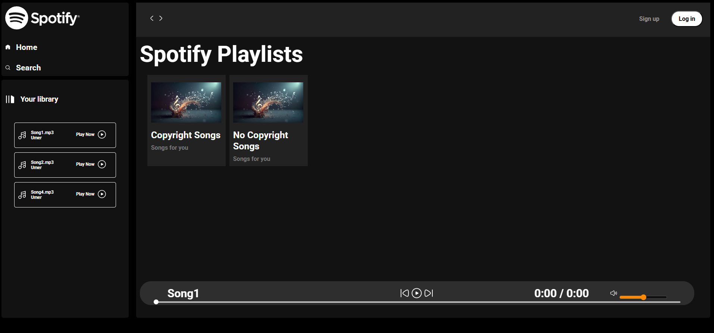

# Spotify Web Player Clone 🎵

This project is a responsive clone of Spotify’s Web Player, built using **HTML**, **CSS**, and **JavaScript**. It features dynamic playlist loading, a custom audio player, and an interactive UI inspired by Spotify.

## 🚀 Features

- 🎧 Audio playback with play/pause, next/previous, and seek support  
- 🎵 Dynamic playlist and album loading from local folders  
- 🎛️ Volume control with mute/unmute  
- 📱 Fully responsive layout with hamburger menu for mobile  
- ⏱️ Real-time progress tracking

## 📁 Folder Structure

```

.
├── index.html
├── style.css
├── utility.css
├── script.js
├── songs/
│   └── \[album folders with .mp3 files, cover.jpeg, info.json]
├── Assets/
│   ├── SVG icons (play.svg, pause.svg, etc.)

````

## 📦 Setup

1. Place your MP3 files inside the `songs/[folder]/` directory.
2. Add an `info.json` in each album folder:
```json
{
  "title": "Album Name",
  "description": "Album Description"
}
````

3. Run a local server:

```bash
npx serve .
```

4. Open `http://127.0.0.1:3000` in your browser.

## 🛠️ Technologies Used

* HTML5
* CSS3 (Flexbox, Media Queries)
* JavaScript (DOM, Audio API, Fetch API)

## 📸 Preview



## 📌 Notes

* Requires local HTTP server to fetch MP3 files.
* Uses only front-end tech, no frameworks or external dependencies.
* **Make sure to include the songs you want to play inside the `songs/ncs` or `songs/cs` folders.**

---

**Enjoy your music! 🎶**

```

Let me know if you want this exported as a `.md` file.
```
